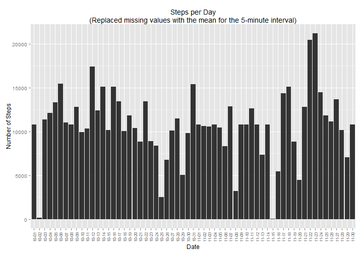

---

#### Loading and preprocessing the data

Show any code that is needed to

1. Load the data (i.e. read.csv())


```r
activity<-read.csv('activity.csv')
```

2. Process/transform the data (if necessary) into a format suitable for your analysis


```r
# Loading libraries
library(plyr)
library(dplyr)
library(data.table)
library(ggplot2)

# Turning off scientific notation
options(scipen=999)

# Converting activity data frame to data table object
activity_dt<-data.table(activity)

# Summarizing activity data by date
daily_steps<-activity_dt[,list(Steps=sum(steps,na.rm=TRUE)),by=c('date')]

# Reformatting date to only include month and day to save space on x-axis of plot
daily_steps$date2<-gsub('2012-','',as.character(daily_steps$date))
```


---

#### What is mean total number of steps taken per day?

For this part of the assignment, you can ignore the missing values in the dataset.

1. Make a histogram of the total number of steps taken each day


```r
ggplot(data=daily_steps, aes(x=date2, y=Steps)) + # Initializing plot
  geom_bar(stat="identity") + # Outputting as barplot
  labs(title = 'Total Steps per Day') + # Adding main title
  xlab('Date') + # Changing x-axis label
  ylab('Number of Steps') + # Chaing the y-axis label
  theme(axis.text.x = element_text(angle=90,vjust=0.5,size=8)) # rotating x-axis labels
```

 

2. Calculate and report the mean and median total number of steps taken per day


```r
# Calculating the mean number of steps per day
mean(daily_steps$Steps,na.rm=TRUE)
```

```
## [1] 9354.23
```

```r
# Calculating the median number of steps per day
median(daily_steps$Steps,na.rm=TRUE)
```

```
## [1] 10395
```

+ The **mean** number of steps per day is 9354.23
+ The **median** number of steps per day is 10395


---

#### What is the average daily activity pattern?

1. Make a time series plot (i.e. type = "l") of the 5-minute interval (x-axis) and the average number of steps taken, averaged across all days (y-axis)


```r
# Summarizing activity data by 5-minute interval
interval_steps<-activity_dt[,list(Avg_Steps=mean(steps,na.rm=TRUE)),by=c('interval')]

ggplot(data=interval_steps, aes(x=interval, y=Avg_Steps)) + # Initializing plot
  geom_line(type='l') + # Outputting as time-series plot
  labs(title = 'Average Steps per 5-Minute Interval') + # Adding main title
  xlab('5-Minute Interval') + # Changing x-axis label
  ylab('Average Number of Steps') # Chaging y-axis label
```

 

2. Which 5-minute interval, on average across all the days in the dataset, contains the maximum number of steps?


```r
filter(interval_steps,Avg_Steps == max(interval_steps$Avg_Steps))$interval
```

```
## [1] 835
```

+ On average across all the days in the dataset, interval **835** contains the maximum number of steps (206.1698113)


---


#### Imputing missing values


Note that there are a number of days/intervals where there are missing values (coded as NA). The presence of missing days may introduce bias into some calculations or summaries of the data.

1. Calculate and report the total number of missing values in the dataset (i.e. the total number of rows with NAs)


```r
# Calculating the number of rows with NA values in the steps column
length(which(is.na(activity$steps)))
```

```
## [1] 2304
```

+ There are a total of **2304** missing values in the dataset (i.e. the total number of rows with NAs)

2. Devise a strategy for filling in all of the missing values in the dataset. The strategy does not need to be sophisticated. For example, you could use the mean/median for that day, or the mean for that 5-minute interval, etc.


```r
## Replacing missing values with the mean for the day

# Creating function to impute mean
impute.mean <- function(x) replace(x, is.na(x), mean(x, na.rm = TRUE))

activity_dt2 <- ddply(activity_dt, ~ date, transform, steps = impute.mean(steps))

# Reordering data
activity_dt2<-arrange(activity_dt2,date,interval)

# Note: Doesn't work as days where all 5-minute intervals are NA remain NA

## Replacing missing values with the median for the day

# Creating function to impute median
impute.median <- function(x) replace(x, is.na(x), median(x, na.rm = TRUE))

activity_dt3 <- ddply(activity_dt, ~ date, transform, steps = impute.median(steps))

# Reordering data
activity_dt3<-arrange(activity_dt3,date,interval)

# Note: Doesn't work as days where all 5-minute intervals are NA remain NA

## Replacing missing values with the mean for the 5-minute interval
  
activity_dt4 <- ddply(activity_dt, ~ interval, transform, steps = impute.mean(steps))

# Reordering data
activity_dt4<-arrange(activity_dt4,date,interval)

# Note: This works

## Replacing missing values with the median for the 5-minute interval
  
activity_dt5 <- ddply(activity_dt, ~ interval, transform, steps = impute.median(steps))

# Reordering data
activity_dt5<-arrange(activity_dt5,date,interval)

# Note: This works as well
```


3. Create a new dataset that is equal to the original dataset but with the missing data filled in.


```r
# Converting activity_dt4 to data table (replaced missing values with the mean for the 5-minute interval)
activity_dt4<-data.table(activity_dt4)

# Summarizing activity data by date for activity_dt4 
daily_steps4<-activity_dt4[,list(Steps=sum(steps,na.rm=TRUE)),by=c('date')]

# Reformatting date to only include month and day to save space on x-axis of plot
daily_steps4$date2<-gsub('2012-','',as.character(daily_steps4$date))


# Converting activity_dt5 to data table (replaced missing values with the median for the 5-minute interval)
activity_dt5<-data.table(activity_dt5)

# Summarizing activity data by date for activity_dt5
daily_steps5<-activity_dt5[,list(Steps=sum(steps,na.rm=TRUE)),by=c('date')]

# Reformatting date to only include month and day to save space on x-axis of plot
daily_steps5$date2<-gsub('2012-','',as.character(daily_steps5$date))
```


4. Make a histogram of the total number of steps taken each day and Calculate and report the mean and median total number of steps taken per day. Do these values differ from the estimates from the first part of the assignment? What is the impact of imputing missing data on the estimates of the total daily number of steps?


```r
ggplot(data=daily_steps4, aes(x=date2, y=Steps)) + # Initializing plot
  geom_bar(stat="identity") + # Outputting as barplot
  labs(title = 'Steps per Day\n(Replaced missing values with the mean for the 5-minute interval)') + # Adding main title
  xlab('Date') + # Changing x-axis label
  ylab('Number of Steps') + # Chaing the y-axis label
  theme(axis.text.x = element_text(angle=90,vjust=0.5,size=8)) # rotating x-axis labels
```

 

```r
# Calculating the mean number of steps per day
mean(daily_steps4$Steps,na.rm=TRUE)
```

```
## [1] 10766.19
```

```r
# Calculating the median number of steps per day
median(daily_steps4$Steps,na.rm=TRUE)
```

```
## [1] 10766.19
```

+ For the dataset where the missing values were replaced with the mean for the 5-minute interval:
+ The **mean** number of steps per day is 10766.19 compared to the original value of 9354.23
+ The **median** number of steps per day is 10766.19 compared to the original value of 10395

Thus imputing missing values with the mean for the 5-minute interval has *increased* the estimates of the total daily number of steps as both the mean and median have increased compared to the original dataset


```r
ggplot(data=daily_steps5, aes(x=date2, y=Steps)) + # Initializing plot
  geom_bar(stat="identity") + # Outputting as barplot
  labs(title = 'Steps per Day\n(Replaced missing values with the median for the 5-minute interval)') + # Adding main title
  xlab('Date') + # Changing x-axis label
  ylab('Number of Steps') + # Chaing the y-axis label
  theme(axis.text.x = element_text(angle=90,vjust=0.5,size=8)) # rotating x-axis labels
```

 

```r
# Calculating the mean number of steps per day
mean(daily_steps5$Steps,na.rm=TRUE)
```

```
## [1] 9503.869
```

```r
# Calculating the median number of steps per day
median(daily_steps5$Steps,na.rm=TRUE)
```

```
## [1] 10395
```

+ For the dataset where the missing values were replaced with the median for the 5-minute interval:
+ The **mean** number of steps per day is 9503.87 compared to the original value of 9354.23
+ The **median** number of steps per day is 10395 compared to the original value of 10395

Thus imputing missing values with the median for the 5-minute interval has *decreased* the estimates of the total daily number of steps as the mean has decreased (slightly) while the median is equal to that of the original dataset

---


#### Are there differences in activity patterns between weekdays and weekends?

For this part the weekdays() function may be of some help here. Use the dataset with the filled-in missing values for this part.

1. Create a new factor variable in the dataset with two levels - "weekday" and "weekend" indicating whether a given date is a weekday or weekend day.


```r
# Creating new variable DayOfWeek in dataset

activity_dt5$DayOfWeek<-weekdays(as.Date(activity_dt5$date))

# Replacing 'Saturday' and 'Sunday' with 'weekend'

activity_dt5$DayOfWeek<-gsub('Saturday','weekend',activity_dt5$DayOfWeek)
activity_dt5$DayOfWeek<-gsub('Sunday','weekend',activity_dt5$DayOfWeek)

# Replacing rest of days with 'weekday'

activity_dt5$DayOfWeek<-gsub('Monday','weekday',activity_dt5$DayOfWeek)
activity_dt5$DayOfWeek<-gsub('Tuesday','weekday',activity_dt5$DayOfWeek)
activity_dt5$DayOfWeek<-gsub('Wednesday','weekday',activity_dt5$DayOfWeek)
activity_dt5$DayOfWeek<-gsub('Thursday','weekday',activity_dt5$DayOfWeek)
activity_dt5$DayOfWeek<-gsub('Friday','weekday',activity_dt5$DayOfWeek)

# Converting DayOfWeek variable to factor class
activity_dt5$DayOfWeek<-as.factor(activity_dt5$DayOfWeek)

# Summarizing activity data by 5-minute interval & DayOfWeek
interval_steps5<-activity_dt5[,list(Avg_Steps=mean(steps,na.rm=TRUE)),by=c('DayOfWeek','interval')]
```

2. Make a panel plot containing a time series plot (i.e. type = "l") of the 5-minute interval (x-axis) and the average number of steps taken, averaged across all weekday days or weekend days (y-axis). See the README file in the GitHub repository to see an example of what this plot should look like using simulated data.


```r
ggplot(data=interval_steps5, aes(x=interval, y=Avg_Steps)) + # Initializing plot
  geom_line(type='l') + # Outputting as time-series plot
  facet_wrap(~ DayOfWeek ,ncol=1) + # Make panels by DayOfWeek
  labs(title = 'Average Steps per 5-Minute Interval') + # Adding main title
  xlab('5-Minute Interval') + # Changing x-axis label
  ylab('Average Number of Steps') # Chaging y-axis label
```

 

---
